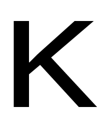

# __Coming Soon Page__

A simple web page with a counter for a school project.

## __Table of Contents__

---

1. Purpose of the product
2. User personas
3. User story
4. Website structure
5. Page description

---

### 1. __Purpose of the product__

This web page was created as part of a school project. It is designed to be a preview for an upcoming website. The counter on the page shows how long it will take until the page is ready.

### __2. User personas__
Taget users of this are peers and supervisor of the creator of this project. 

### __3. User story__
This website shows how long will a user have to wait until this page is open for public.

### __4. Website structure__
Currently, the website consists of only the main page.

### __5. Page description__
The website has a logo, flavicon, supporting text and a counter. The counter counts seconds, minutes, hours and days until the page is completed.

If the browser window becomes narrower in width (less than 650 pixels) and/or lenght (less than 600 pixels), the logo becomes smaller and some of the text disappears. Also, if the width of the page is narrower than 650 pixels, only the days field remains on the counter.

__Page Flavicon__:

__Page Logo__:

  

